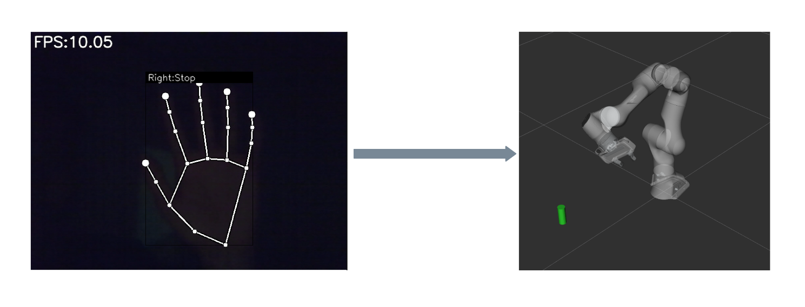

# Gesture Manipulator Project
This is a self-learning project that focuses on using the Moveit2 and ROS humble to develop a pipeline that uses simple hand gestures recognised through webcam to enable a manipulator robot to operate on objects nearby.
The main concept used here is the Moveit Task constructor which helps in developing tasks in form of stages. 

This project is an experiment to understand the concepts of task constructor that can enable a mobile manipulator identify relevant blocks on the field and operate by optimal decision making. This project is a part of developing a mobile manipulator based project

More information can be explored in the link "https://moveit.picknik.ai/main/doc/concepts/moveit_task_constructor/moveit_task_constructor.html".

## Image representation

## Description of the pipeline
1. The gestureNrobot.launch.py file launches multiple nodes necessary for the project: Moveit related nodes, py_handgesture node, ros2_webcam node, gesture subscriber and publisher node.
2. The ros2_webcam ros2 package uses the laptop webcam and publishes camera frames.
3. Another ros2 package called py_handgesture extracts signs given by the user for the manipulator robot. This handgesture uses trained models from mediapipe.
4. Next, based on these gesture classes, operations are published to a rostopic called /move_manipulator which is accessed by the moveit script to move the manipulator
5. As per the recognised gesture, certain stages of moveit are executed.
